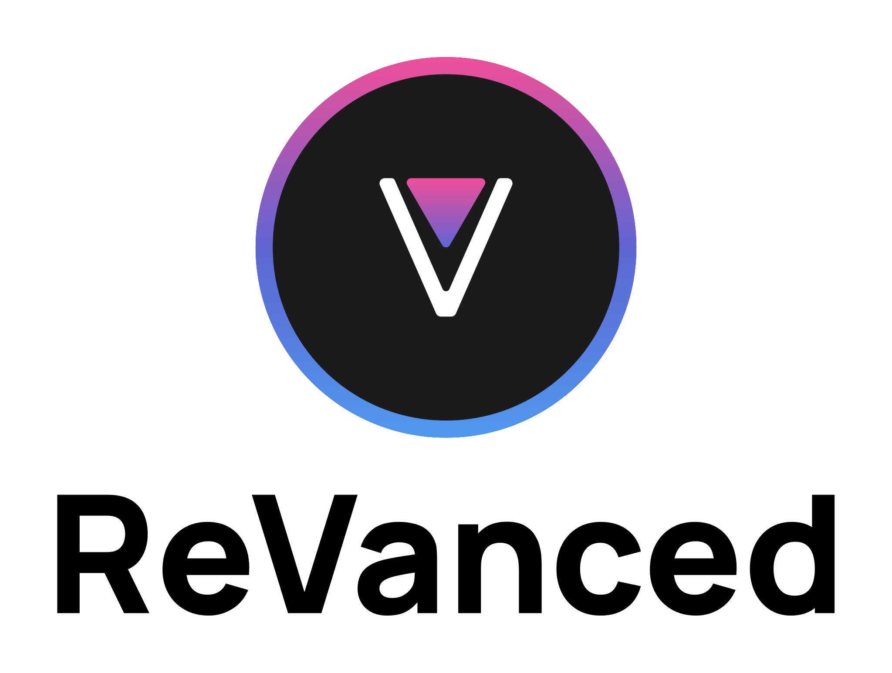
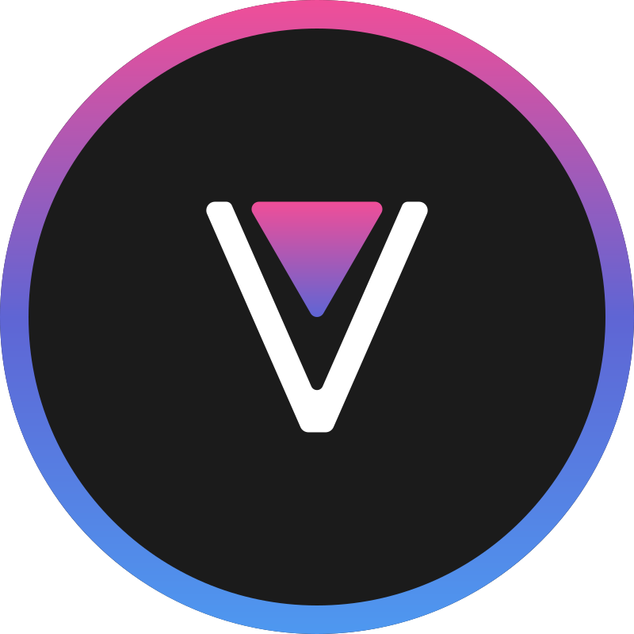

  <picture>
    <source
      width="256px"
      media="(prefers-color-scheme: dark)"
      srcset="assets/revanced-headline/revanced-headline-vertical-dark.svg"
    >
    
  </picture>
   
  <a href="https://revanced.app/">
       <picture>
           <source height="24px" media="(prefers-color-scheme: dark)" srcset="assets/revanced-logo/revanced-logo.svg" />
           
       </picture>
   </a>&nbsp;&nbsp;&nbsp;
   <a href="https://github.com/ReVanced">
       <picture>
           <source height="24px" media="(prefers-color-scheme: dark)" srcset="https://i.ibb.co/dMMmCrW/Git-Hub-Mark.png" />
           
       </picture>
   </a>&nbsp;&nbsp;&nbsp;
   <a href="http://revanced.app/discord">
       <picture>
           <source height="24px" media="(prefers-color-scheme: dark)" srcset="https://user-images.githubusercontent.com/13122796/178032563-d4e084b7-244e-4358-af50-26bde6dd4996.png" />
           
       </picture>
   </a>&nbsp;&nbsp;&nbsp;
   <a href="https://reddit.com/r/revancedapp">
       <picture>
           <source height="24px" media="(prefers-color-scheme: dark)" srcset="https://user-images.githubusercontent.com/13122796/178032351-9d9d5619-8ef7-470a-9eec-2744ece54553.png" />
           
       </picture>
   </a>&nbsp;&nbsp;&nbsp;
   <a href="https://t.me/app_revanced">
      <picture>
         <source height="24px" media="(prefers-color-scheme: dark)" srcset="https://user-images.githubusercontent.com/13122796/178032213-faf25ab8-0bc3-4a94-a730-b524c96df124.png" />
         
      </picture>
   </a>&nbsp;&nbsp;&nbsp;
   <a href="https://x.com/revancedapp">
      <picture>
         <source media="(prefers-color-scheme: dark)" srcset="https://user-images.githubusercontent.com/93124920/270180600-7c1b38bf-889b-4d68-bd5e-b9d86f91421a.png">
         
      </picture>
   </a>&nbsp;&nbsp;&nbsp;
   <a href="https://www.youtube.com/@ReVanced">
      <picture>
         <source height="24px" media="(prefers-color-scheme: dark)" srcset="https://user-images.githubusercontent.com/13122796/178032714-c51c7492-0666-44ac-99c2-f003a695ab50.png" />
         
     </picture>
   </a>
    
    
   Continuing the legacy of Vanced

# 👋 Contribution guidelines

This document describes how to contribute to ReVanced Manager.

## 📖 Resources to help you get started

* The [documentation](/docs/README.md) provides steps to build ReVanced Manager from source
* Our [backlog](https://github.com/orgs/ReVanced/projects/12) is where we keep track of what we're working on
* [Issues](https://github.com/ReVanced/revanced-manager/issues) are where we keep track of bugs and feature requests

## 🙏 Submitting a feature request

Features can be requested by opening an issue using the
[Feature request issue template](https://github.com/ReVanced/revanced-manager/issues/new?assignees=&labels=Feature+request&projects=&template=feature_request.yml&title=feat%3A+).

> **Note**
> Requests can be accepted or rejected at the discretion of maintainers of ReVanced Manager.
> Good motivation has to be provided for a request to be accepted.

## 🐞 Submitting a bug report

If you encounter a bug while using ReVanced Manager, open an issue using the
[Bug report issue template](https://github.com/ReVanced/revanced-manager/issues/new?assignees=&labels=Bug+report&projects=&template=bug_report.yml&title=bug%3A+).

## 📝 How to contribute

1. Before contributing, it is recommended to open an issue to discuss your change
   with the maintainers of ReVanced Manager. This will help you determine whether your change is acceptable
   and whether it is worth your time to implement it
2. Development happens on the `dev` branch. Fork the repository and create your branch from `dev`
3. Commit your changes
4. Submit a pull request to the `dev` branch of the repository and reference issues
   that your pull request closes in the description of your pull request
5. Our team will review your pull request and provide feedback. Once your pull request is approved,
   it will be merged into the `dev` branch and will be included in the next release of ReVanced Manager

## 🤚 I want to contribute but don't know how to code

Even if you don't know how to code, you can still contribute by 
translating ReVanced Manager on [Crowdin](https://translate.revanced.app/).

❤️ Thank you for considering contributing to ReVanced Manager,  
ReVanced
